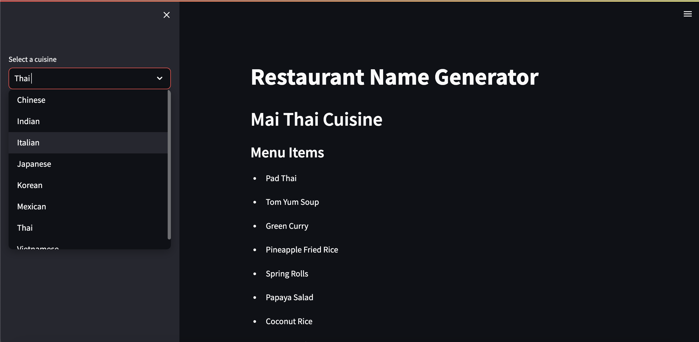

# Restaurant Name Generator

This project generates a restaurant name and sample menu items for a given cuisine using AI. This project was developed for practice purpose.

## Code

The code consists of two Python files:

### langchain_helper.py

This file contains the logic to generate the restaurant name and menu items using the LangChain library. 

- Imports LangChain and sets up the OpenAI API
- Defines a function `generate_restaurant_name_and_items` that takes a cuisine as input
- Chains together two LangChain prompts:
    - Prompt 1 generates a restaurant name based on the cuisine
    - Prompt 2 generates menu items based on the restaurant name
- Returns the generated restaurant name and menu items

### main.py

This runs a simple Streamlit app to call the LangChain generator and display the results.

- Imports and sets up Streamlit and the LangChain helper
- Creates a sidebar to select the cuisine
- Calls the `generate_restaurant_name_and_items` function to get the name and menu items
- Displays the generated name and menu items

## Usage

Run `streamlit run main.py` to start the app. Select a cuisine and it will generate a name and sample menu.

This shows how LangChain can be used to chain prompts together to generate related outputs. The helper keeps the logic separate from the presentation.